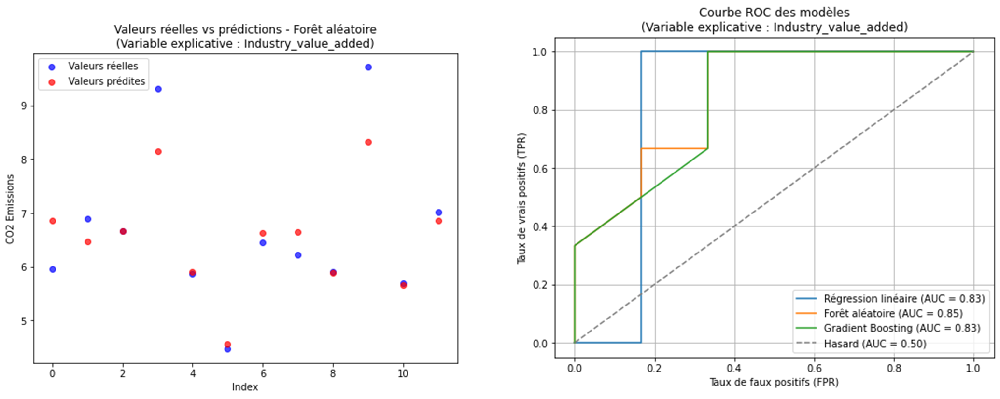

# 🌍 **Multivariate Analysis of CO2 Emissions Using Machine Learning**

This project analyzes the **factors influencing CO2 emissions** in France through **machine learning models**. Using both **economic** and **environmental** data, the objective is to identify how variables like **industry value-added**, **energy consumption**, and **GDP per capita** affect CO2 emissions. The results provide valuable insights for policy-making and environmental management.

---

## **Project Overview**

1. **Data Preparation**  
   - The dataset was cleaned and prepared for analysis to ensure reliability.
   - Missing values were interpolated linearly to maintain data trends.
   - Non-numeric columns were converted into usable formats.
   - The variable `GDP_Per_Capita` was calculated as the ratio between GDP and Population to replace an outlier-ridden variable.
   - Highly correlated variables (e.g., exports and imports) were reduced to a single representative feature to avoid multicollinearity.

2. **Correlation Analysis**  
   - **Industry value-added** and **CO2 emissions** show a strong positive correlation (+0.79), indicating that the industrial sector is a major contributor to emissions.
   - **Electric power consumption** has a negative correlation (-0.67) with emissions, suggesting that cleaner energy sources or infrastructure efficiency may play a role.
   - **GDP per capita** shows a strong negative correlation (-0.77), likely due to the adoption of green technologies and policies in wealthier economies.

---

## **Modeling and Results**

### **Models Used**
- **Linear Regression**  
- **Random Forest**  
- **Gradient Boosting**

### **Key Findings**
- Random Forest models consistently performed best across variables, capturing complex relationships with high accuracy.
- **Industry value-added**:  
  - Random Forest achieved an MSE of **0.38** and an R² of **0.81**, outperforming linear regression (MSE: **1.42**, R²: **0.30**).
- **Electric power consumption**:  
  - Random Forest achieved an MSE of **0.37** and an R² of **0.82**, demonstrating its superiority in modeling non-linear relationships.
- **GDP per capita**:  
  - Random Forest achieved an MSE of **0.29** and an R² of **0.86**, followed closely by Gradient Boosting.

### **Multivariate Model**  
The final multivariate analysis using **Gradient Boosting** achieved a highly predictive model with an MSE of **0.05** and an R² of **0.98**, surpassing the performance of individual models.
### **Model Visualizations and Analysis**

Below are key images from the project report that illustrate correlations, model performance, and prediction accuracy.

---

#### **1. Correlation Matrix**

This heatmap displays the correlation between different numerical variables. Key findings include:
- **Industry value-added** has a strong positive correlation with CO2 emissions (+0.79).
- **Electric power consumption** shows a negative correlation with emissions (-0.67).

---

#### **2. ROC Curve for Electric Power Consumption**

This ROC curve compares model performance for predicting CO2 emissions based on electric power consumption.  
- **Random Forest** achieves the highest performance with an **AUC of 0.97**.

---

#### **3. Actual vs. Predicted Values and ROC Curve (Industry Value-Added)**

- The left plot compares actual vs. predicted CO2 emissions using the **Random Forest** model.  
- The right ROC curve shows strong model performance, with **AUC = 0.85**.

---

#### **4. ROC Curve for Exports of Goods and Services**

This ROC curve evaluates model predictions using **exports** data.  
- The **Random Forest** model performs slightly better than others with an **AUC of 0.76**.

---

#### **5. ROC Curve for Energy Use**

The ROC curve shows model performance when predicting CO2 emissions based on **energy use**.  
- Both **Random Forest** and **Gradient Boosting** achieve similar results, with **AUC values near 0.78**.

---

#### **6. ROC Curve for GDP per Capita**

This ROC curve illustrates model predictions based on **GDP per capita**.  
- The **Gradient Boosting** model achieves near-perfect performance with an **AUC of 1.00**.

---

#### **7. Overall ROC Curve with All Variables**

This plot assesses the combined performance of all variables.  
- Both **Random Forest** and **Gradient Boosting** models achieve excellent results with **AUC values around 0.97**, highlighting the effectiveness of multivariate analysis.

---

These visualizations provide crucial insights into model performance and the key factors influencing CO2 emissions.

---

## **Conclusions**

1. **Industry** is the most significant driver of CO2 emissions, with an increase in industrial contribution to GDP correlating with higher emissions.
2. The **energy mix** plays a crucial role, where clean energy sources (e.g., nuclear, renewables) reduce emissions compared to fossil fuels.
3. **GDP per capita** acts as a mitigating factor, likely due to investments in green technologies and environmental policies.
4. **Energy efficiency** has a moderate impact, helping to curb emissions despite increased energy consumption.
5. **Exports** have a limited direct impact, possibly due to the underlying influence of industrial and energy sectors.

---

## **Next Steps**
- Explore additional machine learning models like **XGBoost**.
- Incorporate external data sources to analyze international trends.
- Conduct scenario-based forecasting to evaluate the impact of policy changes.

---

## **Full Report**

For a comprehensive analysis, including data descriptions, methodology, and detailed results, refer to the **complete project report** available in this repository as a PDF.
